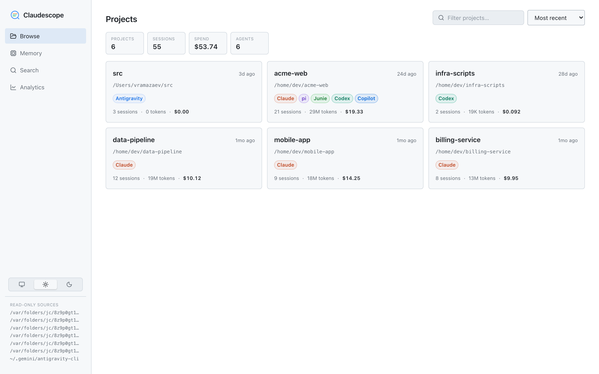
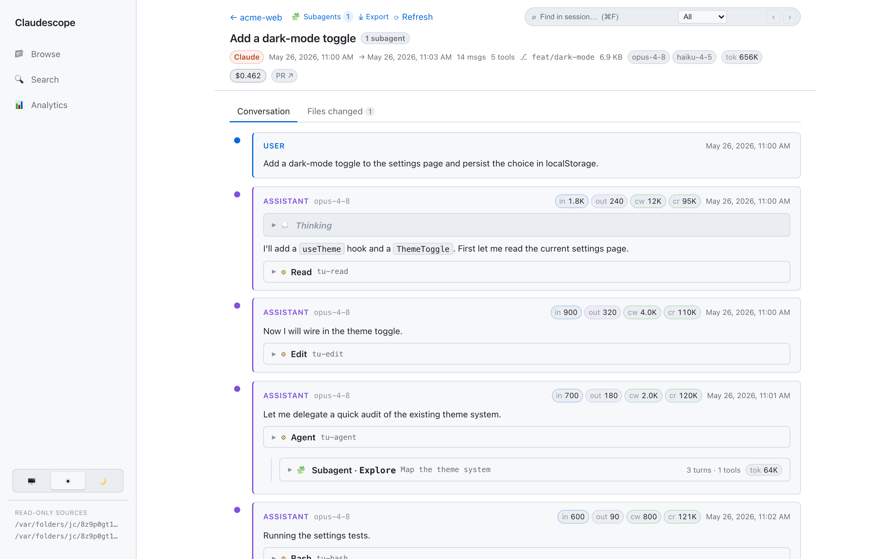
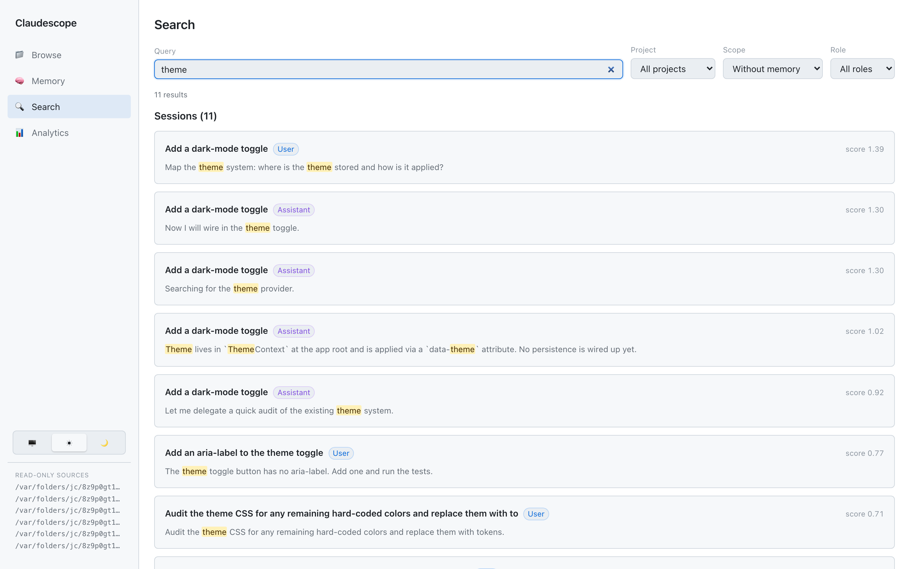
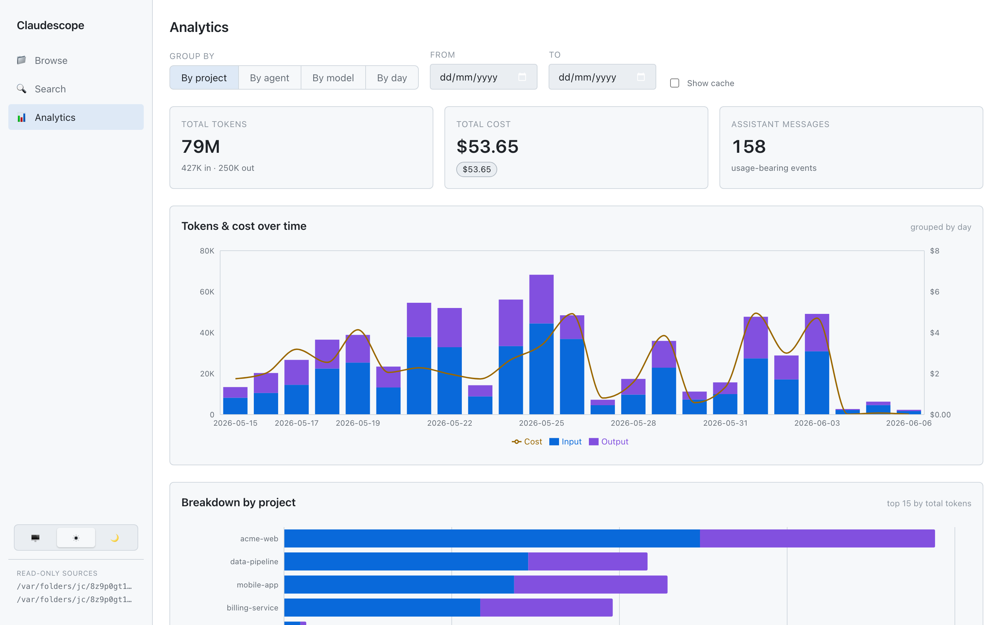
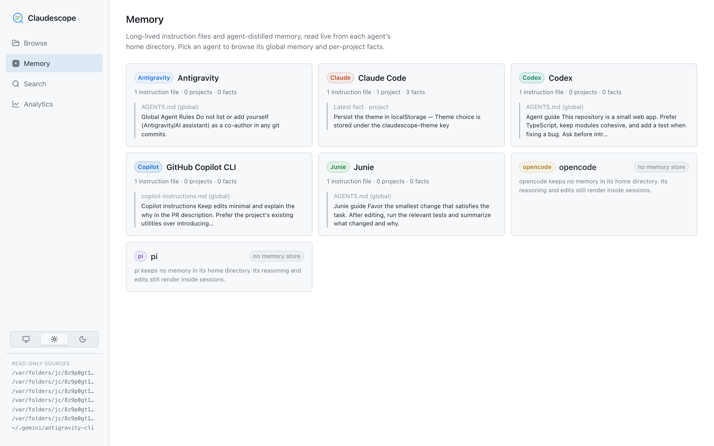

#  Claudescope

[](https://github.com/vladar107/claudescope/actions/workflows/ci.yml)
[](https://www.npmjs.com/package/@vladar107/claudescope)
[](https://nodejs.org)
[](./LICENSE)

*A scope for your AI coding-agent sessions.*

Claudescope is a **local, read-only** viewer that brings every AI coding-agent
transcript on your machine into one place — to browse, read, search, and analyze.
Sessions from every agent that worked in a directory are **merged under one
project**, each tagged with the agent that produced it. It runs entirely on your
machine and only ever reads your transcripts.

## Supported agents

| Agent | Transcripts read from |
| ------------------------------------------------- | --------------------------------------------- |
| [Claude Code](https://claude.com/claude-code)     | `~/.claude/projects/**/*.jsonl`               |
| [OpenAI Codex](https://openai.com/codex)          | `~/.codex/sessions/**/rollout-*.jsonl`        |
| [JetBrains Junie](https://www.jetbrains.com/junie/) | `~/.junie/sessions/session-*/events.jsonl`  |
| [pi](https://pi.dev)                              | `~/.pi/agent/sessions/**/*.jsonl`             |
| [opencode](https://opencode.ai)                   | `~/.local/share/opencode/opencode.db` (SQLite) |
| [GitHub Copilot CLI](https://github.com/features/copilot) | `~/.copilot/session-state/**/events.jsonl` |
| [Google Antigravity](https://antigravity.google) | `~/.gemini/antigravity-cli/brain/**/transcript_full.jsonl` |

Each source is optional — a directory that doesn't exist is simply skipped, so
Claudescope works whether you use one agent or all seven. Adding another is just
[adding another connector](./CONTRIBUTING.md#adding-an-agent-connector).

## What it can do

- **Multi-agent** — Claude Code, Codex, Junie, pi, opencode, GitHub Copilot CLI, and Google Antigravity sessions side by side, each labeled with an **agent badge**. A project that several agents touched shows one card with all its agent tags; drill in and **filter the session list by agent**.
- **Browse** every session grouped by project — titles, dates, message/tool counts, token totals, cost, git branch, PR links.
- **Read** a session as a clean threaded conversation: markdown, syntax-highlighted code, collapsible thinking, paired tool calls + results, **syntax-highlighted red/green diffs** for edits, attachments, and sidechain/subagent turns. A built-in **find-in-session** bar (⌘/Ctrl+F) searches the whole transcript — including collapsed thinking, tool, and subagent content — auto-expanding and highlighting matches, with a user/assistant filter.
- **Review changes** via a **Files changed** tab that aggregates every edit/write in the session by file, with per-file diffs and +/− counts (diffs load lazily per file).
- **Export / share** a session to Markdown — download or copy it, with an optional toggle to **redact** home-dir paths and likely secrets.
- **Memory** — browse each agent's long-lived **instruction files** (`CLAUDE.md`, `AGENTS.md`, …) and **agent-distilled per-project memory**, read live from each agent's home directory; Claude Code facts deep-link back to the session that produced them.
- **Search** full-text across all sessions, all agents (DuckDB BM25), with highlighted snippets that deep-link to the exact message.
- **Analyze** token usage and cost over time, by project, by model, and **by agent** — including cache-hit ratio.
- **Light & dark themes** — follows your system appearance, with a manual toggle.

> **Privacy:** Everything runs locally on `127.0.0.1`. The app **never** writes to
> any agent's data — every source (`~/.claude`, `~/.codex`, `~/.junie`, `~/.pi`,
> `~/.copilot`, `~/.gemini`, and opencode's database) is treated as strictly read-only. Its only persistent
> state lives in `~/.claudescope/` — a DuckDB index, a copy of the pricing file, and
> a cached pricing snapshot (`pricing.fetched.json`), all safe to delete anytime. The
> sole outbound requests are an optional daily check for a newer published version
> (`claudescope update`) and an optional daily pricing refresh (`claudescope pricing
> update`); nothing about your transcripts ever leaves your machine.

---

## Screenshots

> The screenshots below use **synthetic demo data** — every project name, path,
> and message is fabricated. `acme-web` is a multi-agent project worked by all
> seven agents at once. They render light or dark to match your system.

**Browse** — every project and its sessions at a glance, each tagged with the
agents that worked in it: titles, dates, message & tool counts, token totals,
cost, git branch, and PR links.

<picture>
  <source media="(prefers-color-scheme: dark)" srcset="docs/screenshots/browse-dark.png">
  
</picture>

**Read** — a session as a clean threaded conversation: markdown, collapsible
thinking, **syntax-highlighted red/green diffs** for edits, nested **subagent**
runs, per-message token chips, and a **find-in-session** bar (⌘/Ctrl+F) that
auto-expands and highlights matches. The breadcrumb links back to the project's
session list; **Conversation / Files-changed** tabs and an **⤓ Export** (Markdown,
optional redaction) sit in the header.

<picture>
  <source media="(prefers-color-scheme: dark)" srcset="docs/screenshots/session-dark.png">
  
</picture>

**Search** — full-text across every session and agent (DuckDB BM25) with
highlighted snippets and user/assistant filters; each result deep-links to the
exact message.

<picture>
  <source media="(prefers-color-scheme: dark)" srcset="docs/screenshots/search-dark.png">
  
</picture>

**Analyze** — token & cost analytics over time, by project, by model, and **by
agent**, with a cache-read breakdown. Click a chart legend to toggle a series.

<picture>
  <source media="(prefers-color-scheme: dark)" srcset="docs/screenshots/analytics-dark.png">
  
</picture>

**Remember** — every agent's memory in one place: global instruction files
(`CLAUDE.md`, `AGENTS.md`, Copilot instructions) and Claude Code's
**agent-distilled per-project facts**, each with provenance and category. Read
live from every agent's home dir — never indexed — and Claude facts deep-link
back to the session that produced them.

<picture>
  <source media="(prefers-color-scheme: dark)" srcset="docs/screenshots/memory-dark.png">
  
</picture>

---

## Quick start

Install from any one of three channels — all wrap the same package. However you
install it, `claudescope` serves the whole app (UI + API) from a single port
(**http://localhost:4317** by default), runs in the **background**, and opens
your browser. Run it once and forget it; new sessions appear automatically.

### npm (recommended)

**Prerequisite:** [Node.js](https://nodejs.org) **22.12 or newer** (`node -v`).

```bash
npm install -g @vladar107/claudescope
claudescope            # starts the app in the background and opens your browser
```

No global install? `npx @vladar107/claudescope` runs the published CLI once
without installing it.

### Homebrew (macOS / Linux)

```bash
brew tap vladar107/tap
brew install claudescope
claudescope
```

### Nix (any platform)

```bash
nix run github:vladar107/claudescope               # run without installing
nix profile install github:vladar107/claudescope   # or add it to your profile
```

### Commands

```bash
claudescope            # = claudescope start
claudescope start      # start in the background (idempotent), open the browser
claudescope stop       # stop the background server
claudescope restart    # restart it
claudescope status     # is it running? is an update available?
claudescope open       # open the running app in your browser
claudescope logs -f    # tail the server log
claudescope update          # upgrade to the latest published version and restart
claudescope pricing update  # fetch current model prices (LiteLLM) into the local rate table
claudescope help            # full usage

# options: --port <n>   (default 4317, or $PORT)
#          --no-open    (don't open the browser on start)
```

Updating later is just `claudescope update` (or `npm i -g @vladar107/claudescope@latest`).

### Run from source

```bash
git clone https://github.com/vladar107/claudescope && cd claudescope
npm install      # installs all workspace dependencies
npm start        # builds on first run, then serves the app in the foreground
```

`npm start` runs in the foreground (`Ctrl-C` to stop). For the watch-mode dev
loop and how to contribute, see [`CONTRIBUTING.md`](./CONTRIBUTING.md).

### Agent access (MCP)

Claudescope doubles as an MCP server, so a coding agent can query its own
history — "have I hit this error before?", "what did we decide last month?":

```bash
claude mcp add claudescope -- claudescope mcp
```

`claudescope mcp` speaks MCP over stdio and starts the background server on
first use if it isn't already running. Tools: `search_transcripts` (full-text
search with snippet hits), `list_sessions` / `list_projects` (compact listings),
`get_session` (a windowed Markdown slice of one session — pageable, tool
payloads truncated), `get_analytics` (token/cost aggregates), and `get_memory`
(instruction files + distilled agent memory). Output is plain text sized for an
agent's context window; pass `redact: true` to mask home paths and likely
secrets. Everything stays read-only and on localhost.

---

## Configuration

All optional — set via environment variables.

| Variable              | Default                | Description                                                            |
| --------------------- | ---------------------- | ---------------------------------------------------------------------- |
| `PORT`                | `4317`                 | Port the app listens on (or `--port <n>`).                             |
| `CLAUDE_PROJECTS_DIR` | `~/.claude/projects`   | Where to read Claude Code transcripts from. A leading `~` is expanded. |
| `CODEX_SESSIONS_DIR`  | `~/.codex/sessions`    | Where to read OpenAI Codex transcripts from. A leading `~` is expanded.|
| `JUNIE_SESSIONS_DIR`  | `~/.junie/sessions`    | Where to read JetBrains Junie transcripts from. A leading `~` is expanded.|
| `PI_SESSIONS_DIR`     | `~/.pi/agent/sessions` | Where to read pi transcripts from. A leading `~` is expanded.          |
| `OPENCODE_DATA_DIR`   | `~/.local/share/opencode` | Dir holding opencode's `opencode.db` (read-only). Honors `$XDG_DATA_HOME`; override the DB path directly with `OPENCODE_DB_PATH`. |
| `COPILOT_SESSIONS_DIR`| `~/.copilot/session-state` | Where to read GitHub Copilot CLI transcripts from. A leading `~` is expanded. |
| `ANTIGRAVITY_CLI_DIR` | `~/.gemini/antigravity-cli` | Where to read Google Antigravity transcripts from. A leading `~` is expanded. |
| `ANTIGRAVITY_DIR`     | `~/.gemini/antigravity` | Where to read Google Antigravity desktop-app transcripts from. A leading `~` is expanded. |
| `CLAUDESCOPE_HOME`    | `~/.claudescope`       | Where the app keeps its own state (index, pricing copy, logs, PID).    |
| `REINDEX_INTERVAL_MS` | `15000`                | How often to auto-pick-up new/updated sessions. Set `0` to disable.    |

Each agent source is optional — if a directory doesn't exist it's simply skipped,
so the app works whether you use one agent or all seven.

Examples:

```bash
claudescope --port 8080                                  # custom port
CLAUDE_PROJECTS_DIR=/path/to/exported/projects claudescope  # view someone else's transcripts
CODEX_SESSIONS_DIR=/path/to/codex/sessions claudescope   # point at Codex sessions elsewhere
JUNIE_SESSIONS_DIR=/path/to/junie/sessions claudescope   # point at Junie sessions elsewhere
PI_SESSIONS_DIR=/path/to/pi/sessions claudescope         # point at pi sessions elsewhere
OPENCODE_DATA_DIR=/path/to/opencode claudescope          # point at an opencode data dir elsewhere
COPILOT_SESSIONS_DIR=/path/to/copilot/session-state claudescope  # point at Copilot CLI sessions elsewhere
ANTIGRAVITY_CLI_DIR=/path/to/antigravity-cli claudescope # point at Google Antigravity sessions elsewhere
claudescope --no-open                                    # don't pop a browser tab
```

The startup banner prints the resolved URL and the source directories in use, so
you can always confirm what it's reading.

### Cost methodology

Cost is an **estimate computed locally** from token usage — Claudescope has no
access to your real billing. For every **assistant** event (the events that carry
`usage`), it sums each token type times its per-million-token rate:

```
cost = ( input_tokens          × input_rate
       + output_tokens         × output_rate
       + cache_creation_tokens × cache_write_rate
       + cache_read_tokens     × cache_read_rate ) ÷ 1,000,000
```

The per-event cost is computed once at index time and stored, so analytics is
just a `SUM` over events; a project/session total is the sum of its events.

Rates are resolved in a layered lookup:

1. **Fetched exact id** — `~/.claudescope/pricing.fetched.json` (auto-refreshed
   daily from [LiteLLM's community price table](https://github.com/BerriAI/litellm/blob/main/model_prices_and_context_window.json),
   covering Anthropic, OpenAI, Gemini, xAI, Mistral, and DeepSeek models).
2. **Local exact id** — `~/.claudescope/pricing.json` (seeded on first run from
   the shipped default; user-editable; takes precedence over the fetched snapshot
   for any id it defines explicitly).
3. **Family match** — `opus` / `sonnet` / `haiku` / `gemini` / `gpt` substring in
   the model id → the matching family rate from `pricing.json`.
4. **Default** — the `default` entry in `pricing.json`.

The family step means version- or date-suffixed ids (e.g. `claude-haiku-4-5-20251001`,
`gpt-5.x-codex`, `gemini-2.5-flash`) still price correctly. `pricing.json` is the
user-editable fallback and override layer for families and the default rate; the
fetched snapshot provides exact per-model rates for all known models.

Shipped fallback rates (USD per 1M tokens):

| family / model      | input | output | cache write (5m) | cache read |
| ------------------- | ----- | ------ | ---------------- | ---------- |
| Opus 4.5–4.8        | $5    | $25    | $6.25            | $0.50      |
| Opus 4.1 / 4        | $15   | $75    | $18.75           | $1.50      |
| Sonnet 4.x          | $3    | $15    | $3.75            | $0.30      |
| Haiku 4.5           | $1    | $5     | $1.25            | $0.10      |
| Gemini 2.5 Pro-class| $1.25 | $10    | —                | $0.31      |
| GPT-5               | $0.63 | $5     | —                | $0.13      |
| GPT-5.4             | $2.50 | $15    | —                | $0.50      |
| GPT-5.5             | $5    | $30    | —                | $0.50      |
| `<synthetic>`       | $0    | $0     | $0               | $0         |

- Rates **auto-refresh daily** in the background while the server runs. Run
  `claudescope pricing update` to force a refresh at any time. New rates apply
  to newly indexed events; existing indexed costs are unchanged.
- Edit `~/.claudescope/pricing.json` to override families, the default rate, or
  pin specific model prices. Re-index (`POST /api/reindex` or `claudescope
  restart`) to recompute stored costs at the new rates.
- `pricing.json` carries a `schemaVersion`. When an upgrade ships a newer default
  (new families/models or a changed default rate), the app **reconciles your copy
  on startup**: it backs the old file up to `pricing.json.bak`, adds the new
  shipped keys, and **keeps every value you customized**. Your edits are never
  discarded; a copy you've left current is not rewritten.
- The `opus`/`sonnet`/`haiku`/`gemini`/`gpt` family rules use **current**
  pricing; the deprecated Opus 4 / 4.1 ($15/$75) and specific GPT-5 versions are
  pinned via exact `models` entries. Add an exact entry to override any model.

> **Caveat:** these are **list-price estimates** — they ignore any discounts,
> service tier, or batch pricing, and the cache-write rate assumes the 5-minute
> TTL. Treat totals as approximate and best for *relative* comparison
> (project vs project, day vs day), not as an invoice.

The **"Input from cache"** stat is a separate metric:
`cache_read ÷ (cache_read + cache_creation + input)` — the share of prompt tokens
served from cache (legitimately high for Claude Code, which re-reads cached context each turn).

---

## Usage notes

- **First launch** builds the app and indexes your transcripts in the background
  (a few seconds). The browse/search/analytics views populate once indexing
  finishes — `/api/health` reports `{"ready":true}` when it's done.
- **New sessions appear automatically.** The app re-scans on an interval
  (`REINDEX_INTERVAL_MS`, default 15s) and incrementally picks up new or updated
  transcripts — including the session you're currently running — without a
  restart. In an open session, hit **⟳ Refresh** (or ⌘R / Ctrl+R) to pull the
  latest messages in place without losing your scroll position. Each scan is
  near-free when nothing changed; you can also force one with `POST /api/reindex`.
- **Thinking blocks** appear empty because Claude Code stores only a signature
  (and Codex only encrypted reasoning), not the plaintext — the app notes this
  explicitly. (Not a bug.)
- **Codex sessions have no stored title**, so the title falls back to the first
  user message. The same is true for **pi** sessions.
- **Junie sessions render differently.** Junie records an event-sourced UI stream
  rather than a chat log, so a session reads as tool / terminal / file blocks plus
  a final result — there's no assistant prose or thinking to show. Pasted
  screenshots are surfaced inline. Older Junie sessions don't record a working
  directory and group under an **"(unknown — Junie)"** project.
- **pi reasoning renders in full.** Unlike Claude Code / Codex, pi stores the
  plaintext of its thinking blocks, so they show real reasoning rather than an
  empty placeholder. pi keeps no memory in its home dir, so it contributes nothing
  to the memory viewer.
- **opencode is SQLite-backed.** opencode stores all sessions in one read-only
  SQLite database (`opencode.db`), not per-session files; Claudescope reads it via
  Node's built-in `node:sqlite`. Its reasoning renders in full (plaintext), its
  file edits (made via `apply_patch`) show in the **Files changed** tab and as
  diffs, and pasted screenshots embed. Like pi, it contributes no memory.
- **GitHub Copilot CLI records an event-sourced stream**
  (`~/.copilot/session-state/<id>/events.jsonl`). Cost is **session-level** — only
  a cleanly-closed session reports tokens, so a crashed or still-running one shows
  no cost. Reasoning is encrypted (renders empty, like Codex). File edits show in
  the **Files changed** tab; a denied edit is shown but doesn't count as a change.
  Pasted screenshots embed when screenshot-saving is enabled (otherwise a marker
  remains). Its global `copilot-instructions.md` appears in the memory viewer; it
  keeps no per-project memory.
- **Google Antigravity carries no cost data.** Antigravity transcripts store no
  token counts (its per-conversation database is opaque protobuf), so tokens and
  cost are unavailable by design and show as zero / —. Reasoning renders in full —
  like pi, it stores the plaintext of its thinking blocks. Subagents run as
  separate conversations and are shown nested under the call that spawned them.

---

## Contributing & development

Claudescope is open source and contributions are welcome. How it works (the
DuckDB index, the per-agent **connectors**, and the threading parser), the local
dev loop, the test suite, **how to add a connector for another agent**, and the
release process all live in [`CONTRIBUTING.md`](./CONTRIBUTING.md), with
[`CLAUDE.md`](./CLAUDE.md) as the deeper architectural source of truth. To run a
local copy, see [Run from source](#run-from-source) above.

---

## Security & privacy

Claudescope runs entirely on your machine. It treats every agent source
(`~/.claude`, `~/.codex`, `~/.junie`, `~/.pi`, `~/.copilot`, `~/.gemini`, and opencode's database) as
**read-only**, **binds to `127.0.0.1` only**, and sends **no telemetry**. Its only
outbound requests are a cached npm-registry version check for the update notice
and a daily fetch of public model pricing rates from LiteLLM (disable with
`PRICING_REFRESH_INTERVAL_MS=0`). See
[`SECURITY.md`](./SECURITY.md) for the full breakdown of filesystem, network,
shell, and self-update behavior — and how to report a vulnerability.

---

## Troubleshooting

- **App is empty / "sessions directory not found"** — none of `CLAUDE_PROJECTS_DIR`,
  `CODEX_SESSIONS_DIR`, `JUNIE_SESSIONS_DIR`, `PI_SESSIONS_DIR`, `OPENCODE_DATA_DIR`, `COPILOT_SESSIONS_DIR`, or `ANTIGRAVITY_CLI_DIR` points at real transcripts. Check
  the banner and set them correctly. Any source can be absent; only the present
  ones are indexed.
- **`Error: listen EADDRINUSE :4317`** — the port is taken; run `claudescope --port <n>`.
- **Node version errors** — you need Node ≥ 22.12 (`node -v`).
- **Stale or wrong data** — delete `~/.claudescope/index.duckdb*` and
  `claudescope restart` to rebuild the index from scratch.
- **`@duckdb/node-api` install issues** — it ships prebuilt native binaries;
  re-run `npm install` on a supported platform (macOS, Linux, Windows x64/arm64).

---

## License

[MIT](./LICENSE) © Vladislav Ramazaev
