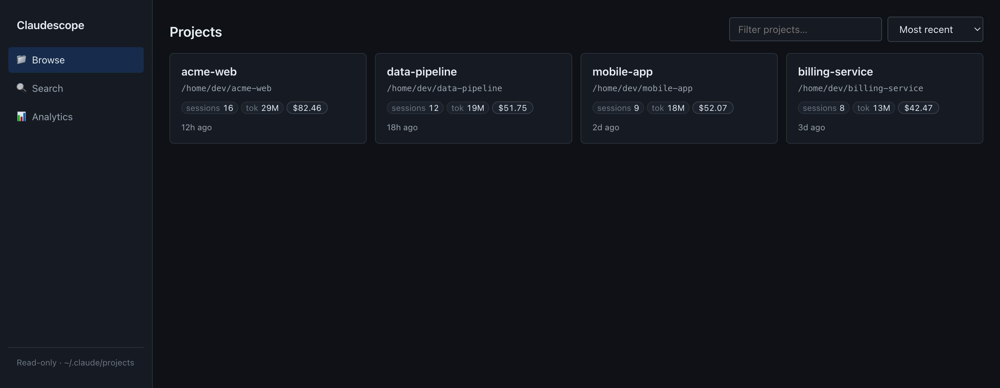
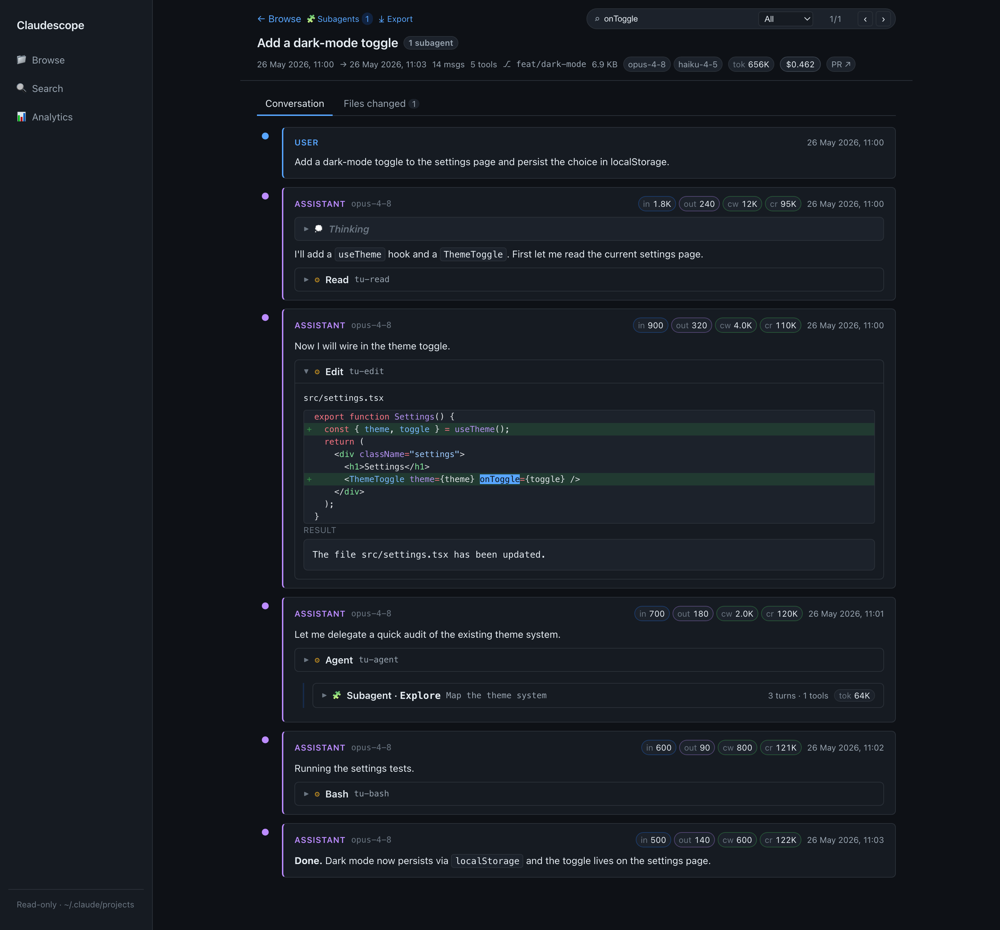
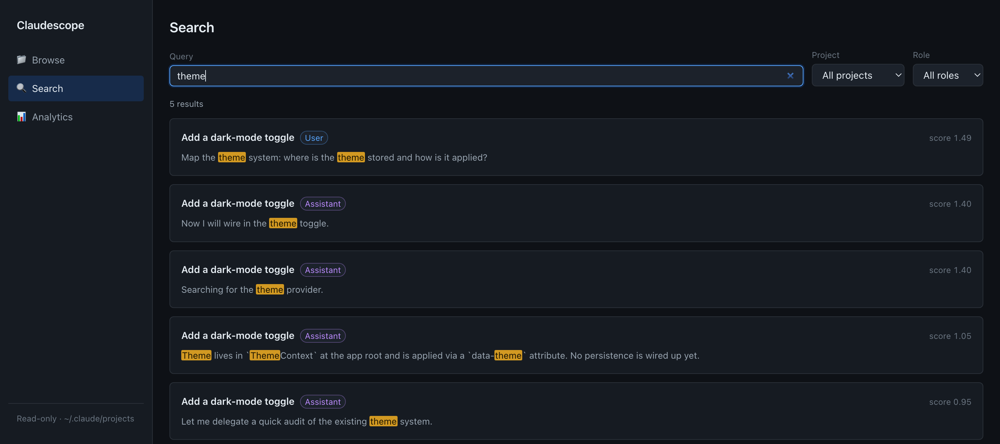
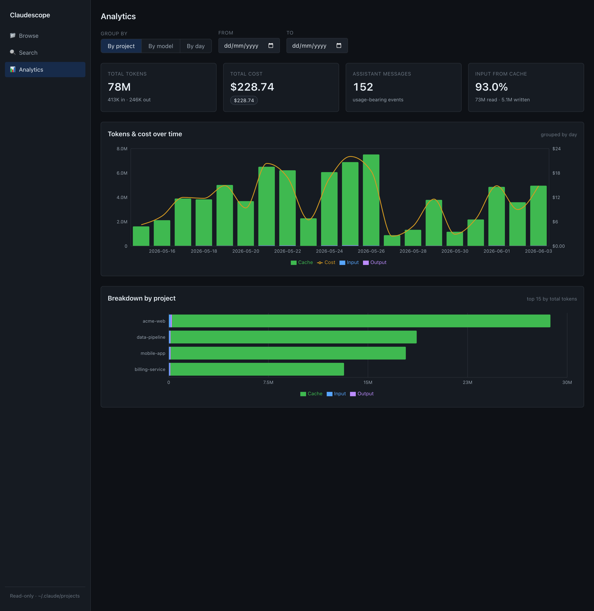

# Claudescope

[](https://github.com/vladar107/claudescope/actions/workflows/ci.yml)
[](https://www.npmjs.com/package/@vladar107/claudescope)
[](https://nodejs.org)
[](./LICENSE)

*A scope for your Claude Code sessions.*

A local, **read-only** web app to browse, read, search, and analyze your
[Claude Code](https://claude.com/claude-code) session transcripts
(`~/.claude/projects/**/*.jsonl`).

- **Browse** every session grouped by project — titles, dates, message/tool counts, token totals, cost, git branch, PR links.
- **Read** a session as a clean threaded conversation: markdown, syntax-highlighted code, collapsible thinking, paired tool calls + results, **syntax-highlighted red/green diffs** for `Edit`/`MultiEdit`, attachments, and sidechain/subagent turns. A built-in **find-in-session** bar (⌘/Ctrl+F) searches the whole transcript — including collapsed thinking, tool, and subagent content — auto-expanding and highlighting matches, with a user/assistant filter.
- **Review changes** via a **Files changed** tab that aggregates every `Edit`/`MultiEdit`/`Write` in the session by file, with per-file diffs and +/− counts (diffs load lazily per file).
- **Export / share** a session to Markdown — download or copy it, with an optional toggle to **redact** home-dir paths and likely secrets.
- **Search** full-text across all sessions (DuckDB BM25), with highlighted snippets that deep-link to the exact message.
- **Analyze** token usage and cost over time, by project, and by model — including cache-hit ratio.

> **Privacy:** Everything runs locally on `127.0.0.1`. The app **never** writes to
> `~/.claude`. Its only persistent state lives in `~/.claudescope/` — a DuckDB
> index and a copy of the pricing file, both safe to delete anytime. The sole
> outbound request is an optional daily check for a newer published version
> (`claudescope update`); nothing about your transcripts ever leaves your machine.

---

## Screenshots

> The screenshots below use **synthetic demo data** — every project name, path,
> and message is fabricated. Reproduce it locally with:
> `node scripts/demo-seed.mjs && CLAUDE_PROJECTS_DIR=.demo/projects npm start`.

**Browse** — every project and its sessions at a glance: titles, dates, message &
tool counts, token totals, cost, git branch, and PR links.



**Read** — a session as a clean threaded conversation: markdown, collapsible
thinking, **syntax-highlighted red/green diffs** for `Edit`/`MultiEdit`, nested
**subagent** runs, per-message token chips, and a **find-in-session** bar (⌘/Ctrl+F)
that auto-expands and highlights matches. **Conversation / Files-changed** tabs and
an **⤓ Export** (Markdown, optional redaction) sit in the header.



**Search** — full-text across every session (DuckDB BM25) with highlighted
snippets and user/assistant filters; each result deep-links to the exact message.



**Analyze** — token & cost analytics over time, by project, and by model, with a
cache-read breakdown. Click a chart legend to toggle a series.



---

## Quick start

**Prerequisite:** [Node.js](https://nodejs.org) **20 or newer** (`node -v`).

### Install (recommended)

```bash
npm install -g @vladar107/claudescope
claudescope            # starts the app in the background and opens your browser
```

`claudescope` serves the whole app (UI + API) from a single port
(**http://localhost:4317** by default), runs in the **background**, and opens
your browser. Run it once and forget it; new sessions appear automatically.

Try it without installing:

```bash
npx @vladar107/claudescope
```

### Commands

```bash
claudescope            # = claudescope start
claudescope start      # start in the background (idempotent), open the browser
claudescope stop       # stop the background server
claudescope restart    # restart it
claudescope status     # is it running? is an update available?
claudescope open       # open the running app in your browser
claudescope logs -f    # tail the server log
claudescope update     # upgrade to the latest published version and restart
claudescope help       # full usage

# options: --port <n>   (default 4317, or $PORT)
#          --no-open    (don't open the browser on start)
```

Updating later is just `claudescope update` (or `npm i -g @vladar107/claudescope@latest`).

### Run from source

```bash
git clone https://github.com/vladar107/claudescope && cd claudescope
npm install      # installs all workspace dependencies
npm start        # builds on first run, then serves the app in the foreground
```

`npm start` runs in the foreground (`Ctrl-C` to stop) — handy for development.

---

## Configuration

All optional — set via environment variables.

| Variable              | Default                | Description                                                            |
| --------------------- | ---------------------- | ---------------------------------------------------------------------- |
| `PORT`                | `4317`                 | Port the app listens on (or `--port <n>`).                             |
| `CLAUDE_PROJECTS_DIR` | `~/.claude/projects`   | Where to read session transcripts from. A leading `~` is expanded.     |
| `CLAUDESCOPE_HOME`    | `~/.claudescope`       | Where the app keeps its own state (index, pricing copy, logs, PID).    |
| `REINDEX_INTERVAL_MS` | `15000`                | How often to auto-pick-up new/updated sessions. Set `0` to disable.    |

Examples:

```bash
claudescope --port 8080                                  # custom port
CLAUDE_PROJECTS_DIR=/path/to/exported/projects claudescope  # view someone else's transcripts
claudescope --no-open                                    # don't pop a browser tab
```

The startup banner prints the resolved URL and the sessions directory in use, so
you can always confirm what it's reading.

### Cost methodology

Cost is an **estimate computed locally** from token usage — Claudescope has no
access to your real billing. For every **assistant** event (the events that carry
`usage`), it sums each token type times its per-million-token rate:

```
cost = ( input_tokens          × input_rate
       + output_tokens         × output_rate
       + cache_creation_tokens × cache_write_rate
       + cache_read_tokens     × cache_read_rate ) ÷ 1,000,000
```

The per-event cost is computed once at index time and stored, so analytics is
just a `SUM` over events; a project/session total is the sum of its events.

Rates live in `~/.claudescope/pricing.json` (seeded on first run from the copy
shipped with the package; when running from source, `packages/server/pricing.json`).
A model id resolves in this order:
exact `models` entry → **family** match (`opus` / `sonnet` / `haiku` substring) →
`default`. The family step means version- or date-suffixed ids (e.g.
`claude-haiku-4-5-20251001`) still price correctly. Shipped rates (USD per 1M tokens,
from Anthropic's published API pricing):

| family / model      | input | output | cache write (5m) | cache read |
| ------------------- | ----- | ------ | ---------------- | ---------- |
| Opus 4.5–4.8        | $5    | $25    | $6.25            | $0.50      |
| Opus 4.1 / 4        | $15   | $75    | $18.75           | $1.50      |
| Sonnet 4.x          | $3    | $15    | $3.75            | $0.30      |
| Haiku 4.5           | $1    | $5     | $1.25            | $0.10      |
| `<synthetic>`       | $0    | $0     | $0               | $0         |

- Edit `~/.claudescope/pricing.json` to update prices or add models, then re-index
  (`POST /api/reindex` or `claudescope restart`) to recompute.
- Or run **`npm run update-pricing`** to refresh `pricing.json` from Anthropic's
  published pricing page. There's no official pricing *API*, so this is a
  best-effort scrape (it validates what it parses and won't write garbage) —
  review the diff afterwards. Use `--dry-run` to preview without writing.
- The `opus`/`sonnet`/`haiku` family rules use **current** pricing; the deprecated
  Opus 4 / 4.1 ($15/$75) are pinned via exact `models` entries. Add an exact entry
  to override any specific model.

> **Caveat:** these are **list-price estimates** — they ignore any discounts,
> service tier, or batch pricing, and the cache-write rate assumes the 5-minute
> TTL. Treat totals as approximate and best for *relative* comparison
> (project vs project, day vs day), not as an invoice.

The **"Input from cache"** stat is a separate metric:
`cache_read ÷ (cache_read + cache_creation + input)` — the share of prompt tokens
served from cache (legitimately high for Claude Code, which re-reads cached context each turn).

---

## Usage notes

- **First launch** builds the app and indexes your transcripts in the background
  (a few seconds). The browse/search/analytics views populate once indexing
  finishes — `/api/health` reports `{"ready":true}` when it's done.
- **New sessions appear automatically.** The app re-scans on an interval
  (`REINDEX_INTERVAL_MS`, default 15s) and incrementally picks up new or updated
  transcripts — including the session you're currently running — without a
  restart. In an open session, hit **⟳ Refresh** (or ⌘R / Ctrl+R) to pull the
  latest messages in place without losing your scroll position. Each scan is
  near-free when nothing changed; you can also force one with `POST /api/reindex`.
- **Thinking blocks** appear empty because Claude Code stores only a signature,
  not the reasoning text — the app notes this explicitly. (Not a bug.)

---

## How it works

npm-workspaces monorepo:

| Package            | Role                                                                  |
| ------------------ | --------------------------------------------------------------------- |
| `packages/shared`  | TypeScript types — the API + data contract shared by server and web.  |
| `packages/server`  | Fastify API + DuckDB index (`@duckdb/node-api`). Serves the built UI.  |
| `packages/web`     | Vite + React UI (react-markdown, Shiki, Recharts).                     |

DuckDB reads the JSONL natively (`read_ndjson`) for indexing, full-text search,
and analytics; a small TypeScript parser assembles the threaded view for a single
session. The index is a derived cache — if it's ever corrupted (e.g. the process
is killed mid-write) the app discards and rebuilds it automatically.

---

## Development

```bash
npm run dev        # server (watch) on :4317 + Vite dev server on :5317 with HMR
npm run typecheck  # tsc -b across all packages
npm run build      # production build (shared → web → server)
npm run serve      # run the built server without rebuilding
npm test           # run the test suite (Vitest)
npm run test:watch # watch mode
```

Tests use [Vitest](https://vitest.dev). Unit tests cover the thread/subagent
parser and pure helpers; the **integration suite** builds a real DuckDB index
from synthetic fixtures (in a temp dir / temp DB — your real `~/.claude` is never
touched) and exercises every API endpoint end-to-end via Fastify `inject()`.

In dev, open the **Vite** URL (http://localhost:5317); it proxies `/api` to the
server.

### Releasing

The published package is a single bundle assembled by `npm run bundle` (esbuild
inlines the server + shared lib; the web build and a default pricing file are
copied alongside; only `@duckdb/node-api` stays an external native dependency).
Releases are **tag-only** — never published from a laptop:

```bash
npm version patch        # bumps package.json + creates the vX.Y.Z tag
git push --follow-tags   # the tag triggers .github/workflows/release.yml → npm publish
```

The release workflow verifies the tag matches `package.json`, runs the tests,
bundles, and publishes. Auth uses npm **Trusted Publishing** (OIDC) — no
`NPM_TOKEN` secret — and provenance is attached automatically.

---

## Security & privacy

Claudescope runs entirely on your machine. It treats `~/.claude` as **read-only**,
**binds to `127.0.0.1` only**, sends **no telemetry**, and its sole outbound
request is a cached npm-registry version check for the update notice. See
[`SECURITY.md`](./SECURITY.md) for the full breakdown of filesystem, network,
shell, and self-update behavior — and how to report a vulnerability.

---

## Troubleshooting

- **App is empty / "sessions directory not found"** — `CLAUDE_PROJECTS_DIR`
  doesn't point at real transcripts. Check the banner and set it correctly.
- **`Error: listen EADDRINUSE :4317`** — the port is taken; run `claudescope --port <n>`.
- **Node version errors** — you need Node ≥ 20 (`node -v`).
- **Stale or wrong data** — delete `~/.claudescope/index.duckdb*` and
  `claudescope restart` to rebuild the index from scratch.
- **`@duckdb/node-api` install issues** — it ships prebuilt native binaries;
  re-run `npm install` on a supported platform (macOS, Linux, Windows x64/arm64).

---

## License

[MIT](./LICENSE) © Vladislav Ramazaev
