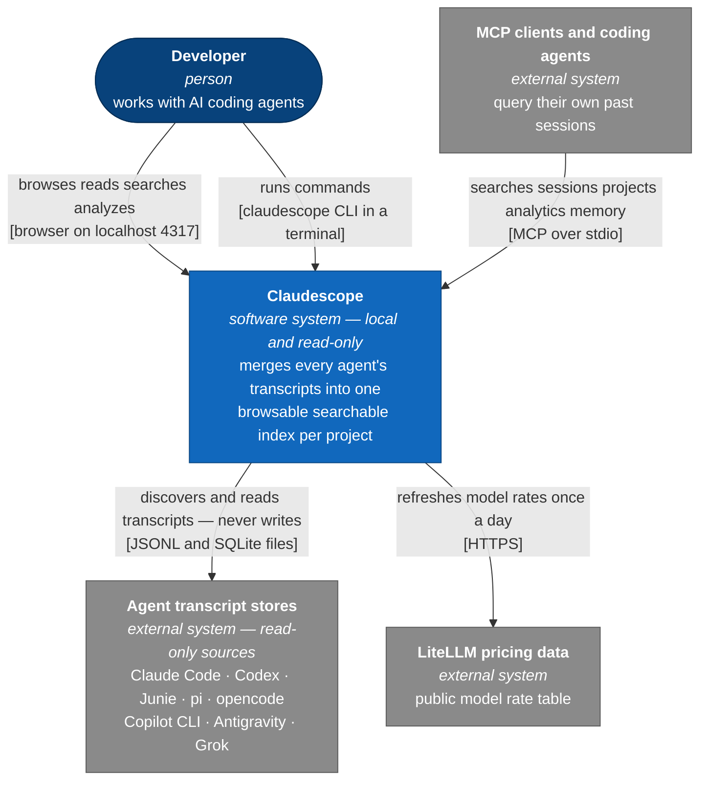
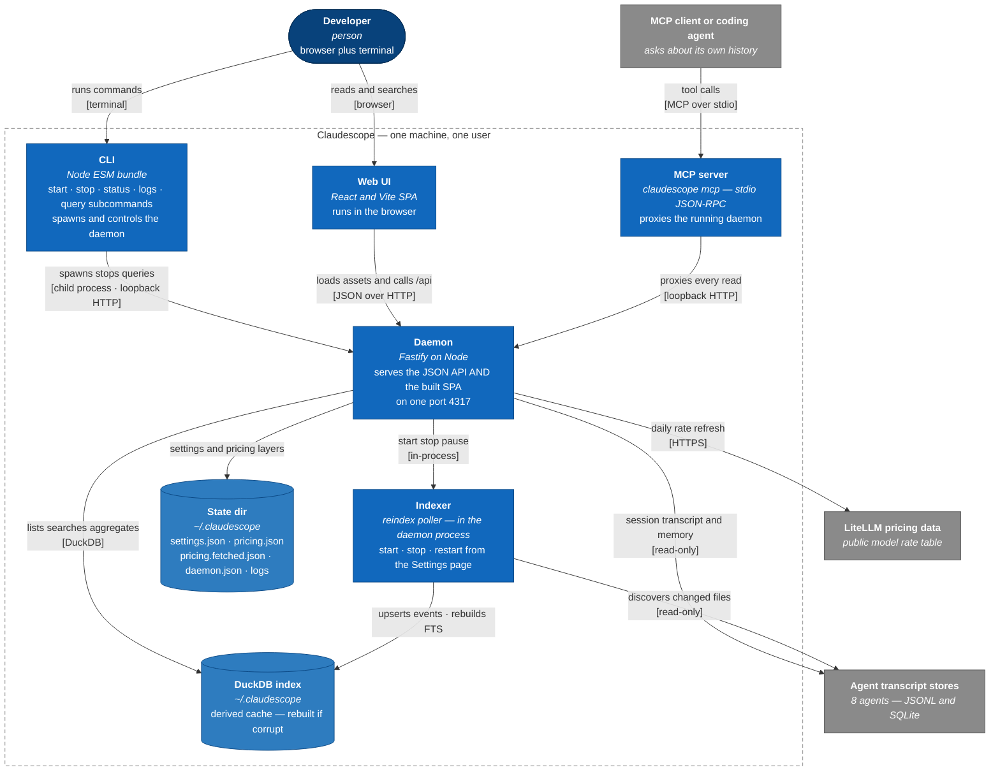
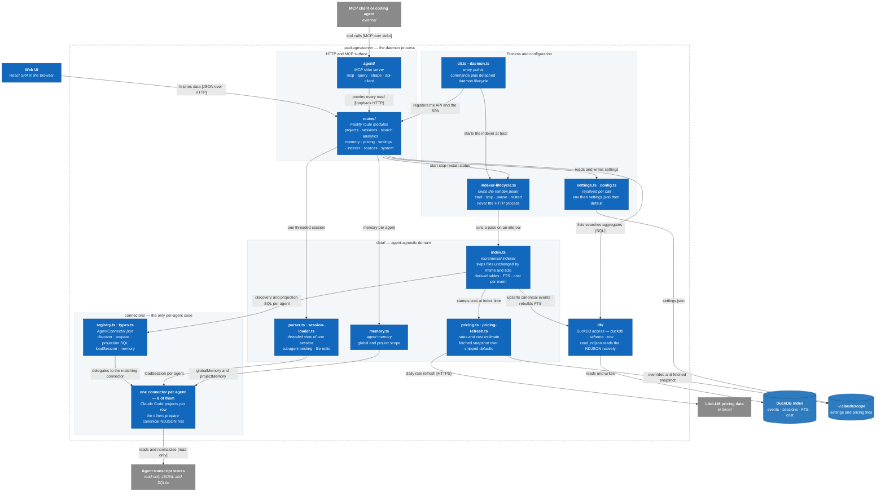

# Architecture

Claudescope drawn as [C4 model](https://c4model.com) diagrams — level 1 (system
context), level 2 (containers), and level 3 (components of the server package).
[`CLAUDE.md`](../CLAUDE.md) stays the prose source of truth for the
architecture, the runtime-state rules, and the per-connector quirks; this file
only visualizes it. For the dev loop and the connector checklist see
[`CONTRIBUTING.md`](../CONTRIBUTING.md).

The diagrams keep C4's element kinds and colors — person, system, container,
component, external system, datastore — but are drawn as Mermaid **flowcharts**
rather than Mermaid's native `C4*` syntax, which overlaps relationship labels
with boxes once a diagram has more than a handful of elements.

## Level 1 — System context

Claudescope is a local, single-user tool: one developer, one machine. It reads
the on-disk transcript stores of eight coding agents **read-only**, indexes them
into its own cache, and serves a browser UI plus a JSON API on one port. Coding
agents can query the same read paths over MCP. Outbound network traffic is
limited to the daily model-rate refresh used to estimate cost, plus a
once-a-day update-availability check against the npm registry (omitted from
the diagram).

## Level 2 — Containers

The daemon is one Fastify process serving **both** the JSON API and the built
SPA on port 4317; the CLI spawns and controls that process. The indexer is drawn
as its own container for clarity but runs **in-process inside the daemon**
(`indexer-lifecycle.ts`) — the web Settings page's Start/Stop/Restart control
that poller, never the HTTP process, which stays terminal-only. The DuckDB index
is a derived cache: fully rebuildable from the transcripts, discarded and
rebuilt if corrupt. All app-owned state lives in `~/.claudescope/`, where env
vars always win over `settings.json`.

## Level 3 — Components of the server package

The interesting seam is the connector pipeline. Each agent is one connector
implementing the `AgentConnector` port; Claude Code JSONL is projected per row,
while every other agent runs a `prepare()` pass that normalizes a session to
**canonical NDJSON** first. Everything below that boundary — the canonical
schema, indexing, full-text search, cost, threading, and the UI — is
agent-agnostic and shared, so **adding an agent means adding a connector and the
shared paths stay untouched**. DuckDB reads the NDJSON natively via
`read_ndjson`, which keeps indexing, search, and analytics in the database;
only the threaded view of a single session is assembled in TypeScript.

